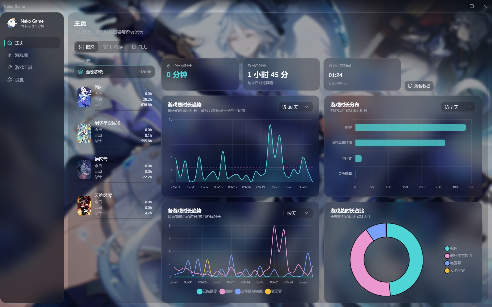
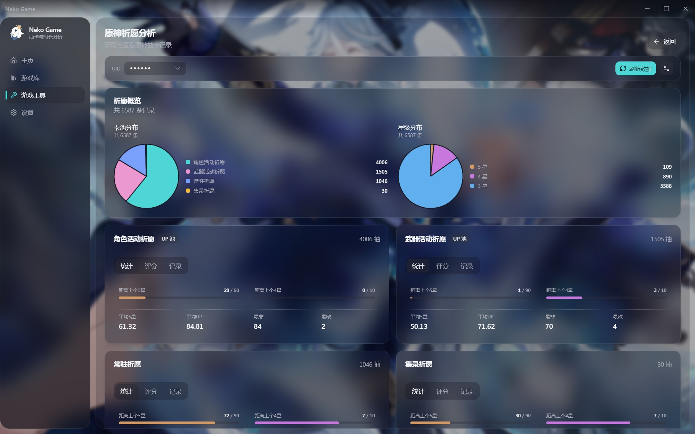
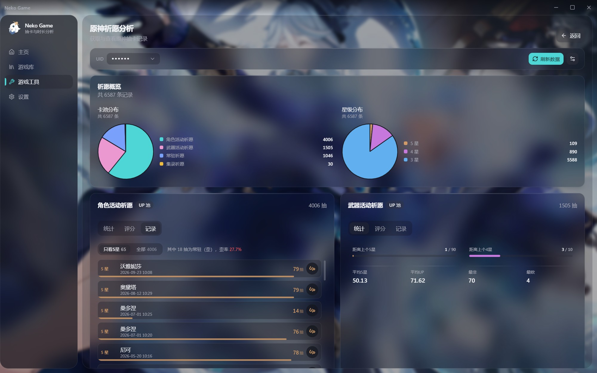
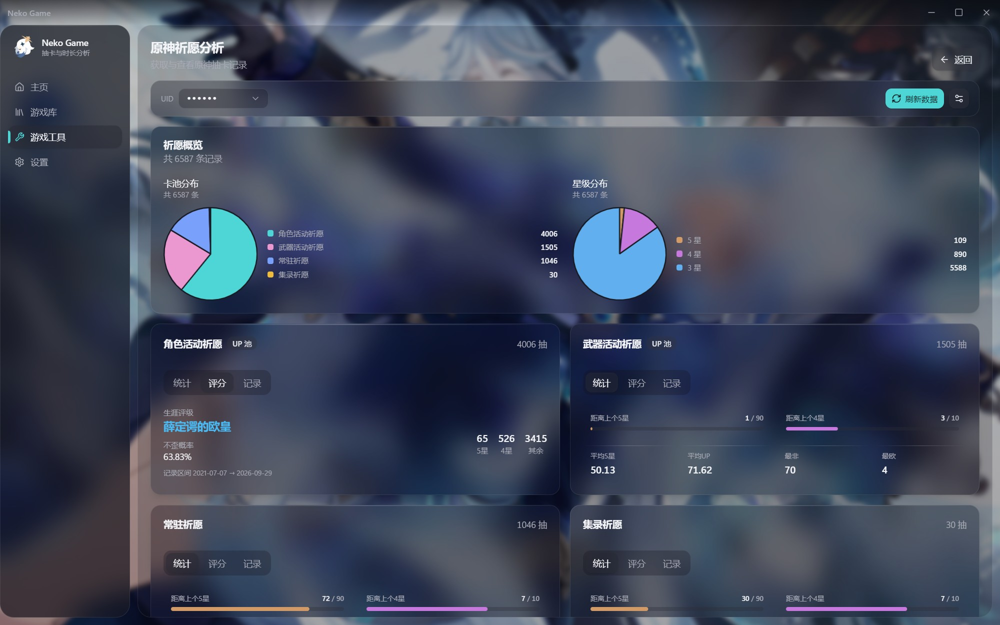
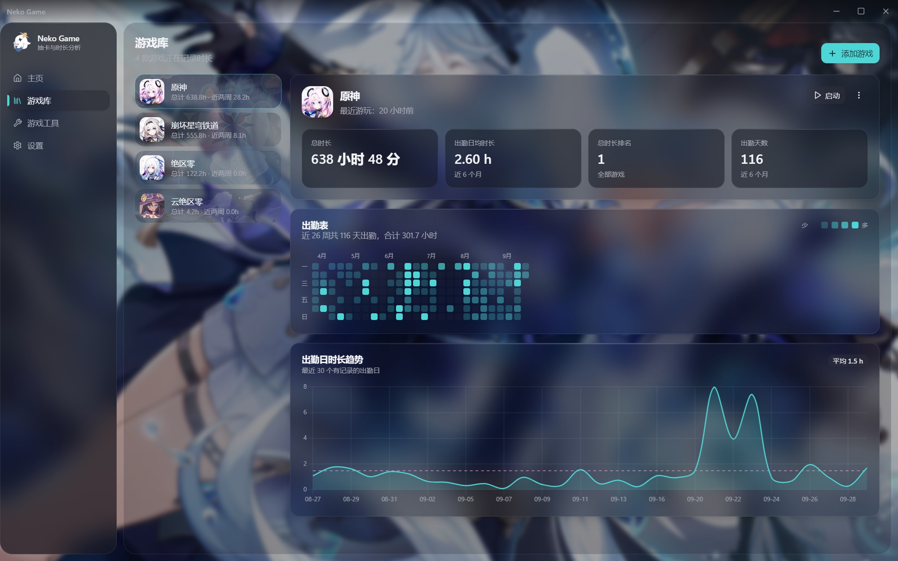
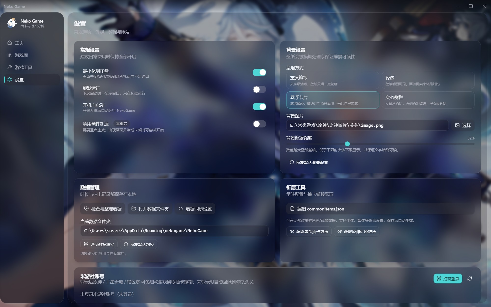

# Neko Game

**[中文](README.md)** | **English**

---

## 🙏 Credits & Provenance

**This project is a secondary development (fork) of [Summer-Neko/NekoGame](https://github.com/Summer-Neko/NekoGame), not an independent original work.**

- Original author: **Summer-Neko** — thanks for open-sourcing Neko Game, which provides every core feature and the underlying implementation of this project.
- Upstream repository (read-only reference): <https://github.com/Summer-Neko/NekoGame>

---

## 📝 Overview

Neko Game is a gacha analysis and game management application for recording, analyzing, and presenting your gaming activity. Built on **Electron**, it provides gacha analysis for **Genshin Impact, Honkai: Star Rail, Zenless Zone Zero, and Miliastra: Ember Song**, plus playtime tracking and trend visualization.

This repository (`Furina1027/NekoGame`) builds on that foundation as follows.



## ✨ What This Repository Changes

### Full UI rewrite

The renderer was migrated from vanilla DOM + jQuery to **React 19 + TypeScript + Vite + Tailwind CSS v4 + shadcn/ui**; the main process stays CommonJS. The original UI is preserved under `legacy/` for reference only and is excluded from builds.

- Loads the production bundle over a custom `app://` protocol (ES modules are CORS-blocked under `file://`, so React would never run)
- Adds a restricted `media://` proxy for user-supplied wallpapers, icons, and posters (image extensions only)
- Four background presentation styles with an adjustable mask strength; the "floating cards" style deliberately lightens the mask to showcase the wallpaper
- Every route is wrapped in an `ErrorBoundary`, so a single crashing page no longer whites out the whole window

### Defect fixes

- preload `on*` subscriptions now consistently return an unsubscribe function, fixing a permanent black screen after switching tabs
- CSS minification downgraded standard `backdrop-filter` to the `-webkit-` prefixed form only, which Chromium 130 ignores — this silently disabled **both the mask slider and all frosted glass**; fixed via `cssTarget` plus dropping hand-written prefixes
- `.glass-sheen`'s `position: relative` overrode `.fixed`, pushing dialogs outside the window so they never appeared
- Chart.js cached a zero-width size when constructed inside a hidden tab, so "only the first chart renders"
- canvas cannot resolve `var()`, so passing CSS custom properties directly painted entire charts black
- Removed `backdrop-filter` from the main scroll container (every scroll frame re-blurred the whole window backdrop): measured average frame interval on the home page dropped from 35.5ms → 24.1ms
- Fixed the `starRail` card-pool key casing and an inverted hardware-acceleration default

### Feature changes

- Gacha record list aligned with [TeyvatGuide](https://github.com/TeyvatGuide): rotated badges, pity progress bars, ratings, and off-banner rates
- New "gacha overview": pool distribution and rarity distribution pie charts
- Refreshing gacha data now shows the current pool and page in real time, then reloads the UI automatically
- Genshin / ZZZ / Miliastra fetch directly via the HoYoLAB cookie — no need to open the in-game gacha screen first
- **Removed**: gacha planning, auto-update (`electron-updater`), and the first-launch changelog window

> The removal of gacha planning comes from this repository's own commit `2737dfa` (authored by the fork author), not from upstream.

## Features

- **Playtime tracking**: automatic, with detailed statistics
- **Gacha analysis**: Genshin, HSR, ZZZ, and Miliastra; links are auto-copied to the clipboard
- **Gacha overview**: pool distribution and rarity distribution pie charts
- **Import / export**: `UIGF4.0` export for Genshin / HSR / ZZZ; `UIGF3.0` and `SRGF1.0` import
- **Game library**: add, edit, and remove tracked games
- **Analytics**: trend charts, playtime distribution, heatmaps
- **Seamless use**: minimize to tray, run in the background, start at login
- **Data storage**: kept locally by default; optional self-hosted upload (you supply your own repository — nothing depends on the original author's services)

## Installation

This repository no longer ships prebuilt binaries. Build from source:

```bash
git clone https://github.com/Furina1027/NekoGame.git
cd NekoGame
npm install          # also rebuilds native modules for Electron
npm run dist         # produces an installer in dist/
```

## Development

```bash
npm run dev        # Vite HMR + Electron
npm run typecheck  # tsc --noEmit
npm run build      # typecheck + renderer build
npm run dist       # full package
```

### Tech stack and layout

```
electron/            main process (CommonJS)
  main.js            entry; registers the app:// and media:// protocols
  preload.js         IPC API exposed via contextBridge
  app/               database, game tracking, IPC dispatch
  utils/             HoYoLAB login, gacha links, data upload, background settings
src/                 renderer (React + TypeScript)
  components/ui/     shadcn/ui components
  components/chart/  Chart.js wrapper
  hooks/             theme, background, toast
  lib/               gacha.ts (gacha math), chart-color.ts, format.ts, utils.ts
  pages/             home / library / tools / settings / gacha modules
  windows/dataSync/  data sync window (separate Vite entry)
legacy/              the original pre-rewrite pages and scripts, reference only
scripts/screenshot.js dev-time UI screenshot tool
```

**Design system**: colors, radii, shadows, and blurs live in CSS variables in `src/styles/globals.css`; components never hardcode `rgba()`. Mask strength is controlled by a settings slider, with per-style dimming gains and legibility floors.

## Usage

- **Gacha analysis**: for Genshin / ZZZ / Miliastra, sign in to HoYoLAB on the settings page first, then click "Refresh Data". HSR requires the in-game gacha screen to have been opened within the last 30 minutes.
- **Add a game**: provide a name, icon, poster, and the game path — **the main executable, not the launcher**.
- **Edit / remove**: select a game in the library and use the `⋮` menu.
- **Settings**: keeping all general options enabled is recommended; data sync is configured here.
- **Game images**: available from [SteamGridDB](https://www.steamgriddb.com/) (search using the English title); animated images are supported.
- **Playtime**: recorded games are tracked automatically.

## Screenshots

<table>
<tr>
<td width="50%"><br><sub>Home: overview across all games and playtime trends</sub></td>
<td width="50%"><br><sub>Gacha overview: pool and rarity distribution</sub></td>
</tr>
<tr>
<td><br><sub>Gacha records: badges and pity progress</sub></td>
<td><br><sub>Rating: career rating and off-banner rate</sub></td>
</tr>
<tr>
<td><br><sub>Library: game management and attendance</sub></td>
<td><br><sub>Settings: general options and four background styles</sub></td>
</tr>
</table>

> UIDs and the local username have been redacted in these screenshots.

## Troubleshooting

- **Playtime not recorded**: confirm the path points at the main executable rather than a launcher (usually `Launcher.exe`)
- **Permission errors**: if the message mentions `gameTracker.js`, it can be ignored — the OS denied the query; restart the app
- **Unknown publisher**: the installer is unsigned, which is expected
- **Slow gacha link retrieval for Genshin / ZZZ**: those games relocate their log directory each version, so a failed HoYoLAB token exchange falls back to reading the local cache

### Known limitations

- Gacha analysis and import/export are only tested against the Chinese servers
- Handling of very old playtime data (roughly 10 years back) needs improvement
- Analytics only display the last six months; older data is kept but not shown

## Assets and acknowledgments

- Uses the [UIGF API](https://uigf.org/en/api.html) to convert between `item_id` and `name`
- The gacha record page interaction design was inspired by [TeyvatGuide](https://github.com/TeyvatGuide) — thanks
- The app icon and name are inherited from the original project; background artwork is chosen by the user, and this repository ships no artwork
- Built on [Tailwind CSS](https://tailwindcss.com/), [Radix UI](https://www.radix-ui.com/), [Chart.js](https://www.chartjs.org/), and [TeyvatGuide](https://github.com/TeyvatGuide)

## License

[GPL-3.0](LICENSE)　© 2023 Summer-Neko (original)　© 2026 Furina1027 (fork)
